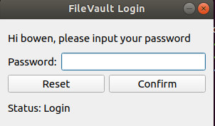
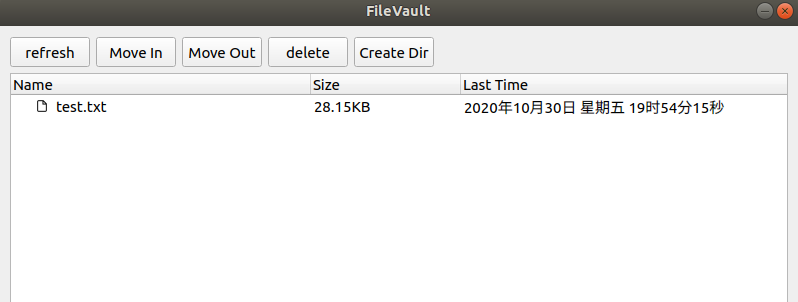

# FileVault CMD Version
## prerequisite
**Linux kernel 4.18**

## Progress and Details
- 创建保险箱文件夹/home/safebox; 创建/home/safebox/password.dat用于存储所有用户的保险箱密码。
- 内核模块
  - 重载系统调用，屏蔽非保险箱管理程序对保险箱文件夹的访问。
  - 如何区分管理程序与其他程序：保险箱管理程序每次操作都会通过netlink发送其pid(process id)。

|重载的系统调用|屏蔽的命令|
|---|---|
|`openat`|`ls`, `vim`, `cat`, `cp`, `touch`|
|`chdir`|`cd`|
|`mkdir`|`mkdir`|
|`symlinkat`|`ln -s`|
|`linkat`|`ln`|
|`rename`|`mv`|

- 用户模块
  - 用户身份认证。通过uid判断用户身份，若该用户已注册，则引导他输入密码；若该用户未注册，则令他设置一个密码并为他创建一个保险箱文件夹，如/home/safebox/user
  - 完成账号密码信息的存储与加密。将保险箱现有用户的uid和密码存储在password.dat文件中，该文件使用base64进行加密存储。程序需要获取用户信息时再使用base64进行解密

## Linux Command
 - `strace [cmd]`: trace system calls of [cmd].
 - `insmod [module].ko`: load the driver.
 - `lsmod`: check drivers.
 - `rmmod [module]`: unload the driver, [module] can be seen in `lsmod`.
 - `du -sh`: check current directory size.

## Notes
 - `di, si, dx, r10, r8, r9`: [pt_regs structure](https://www.codenong.com/cs106088896/)

# FileVault GUI Version
## prerequisite
**Qt 5.14.2**

## Progress and Details
- 身份认证 + 访问保险箱中文件

## Demo

  